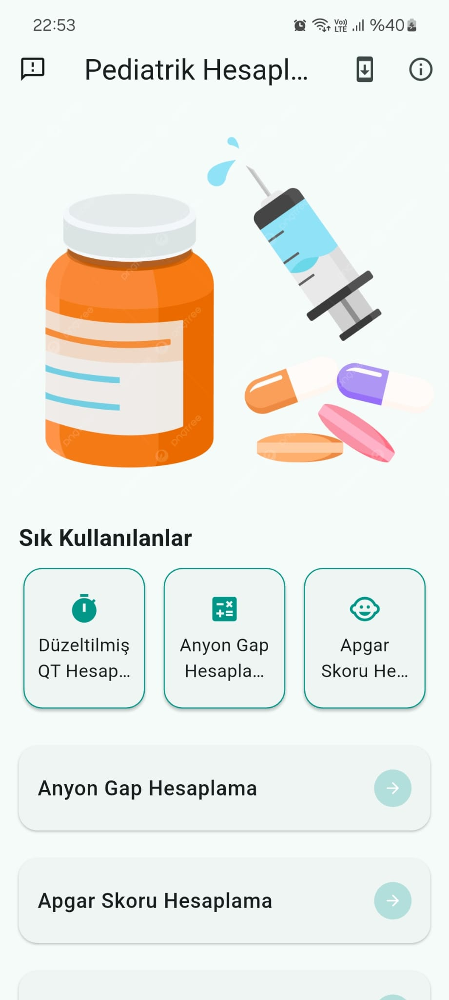
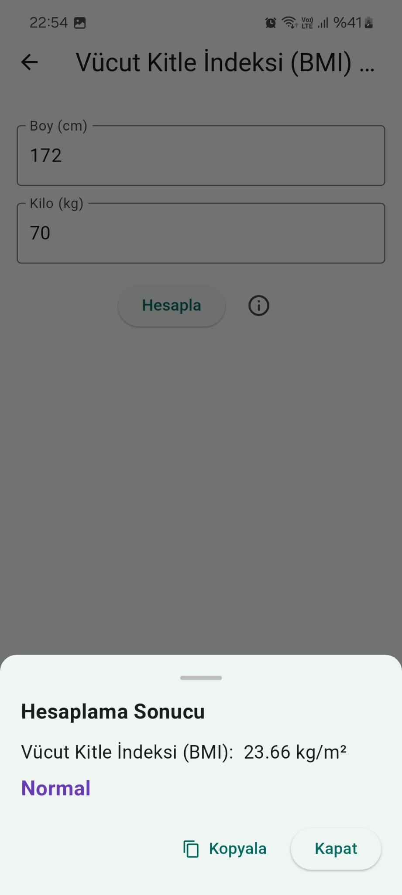
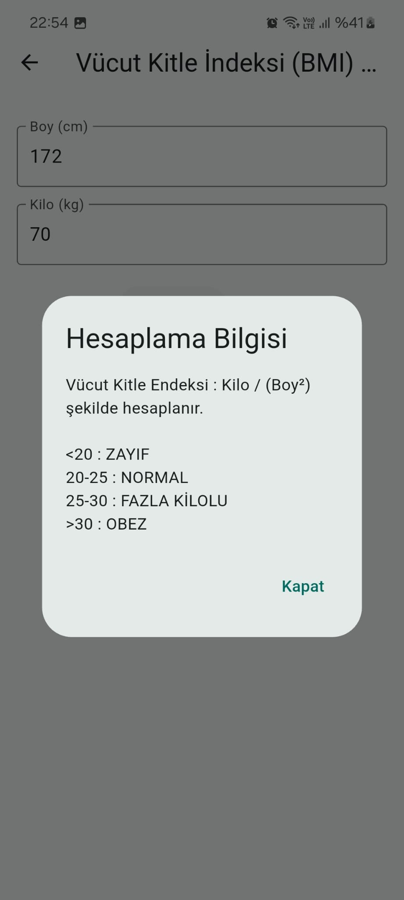
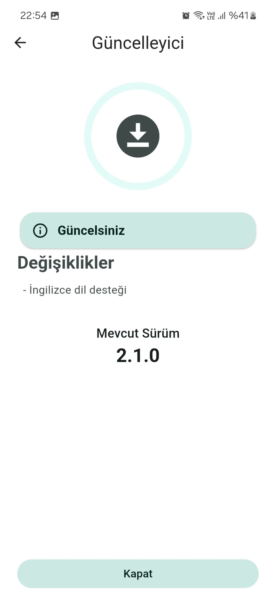
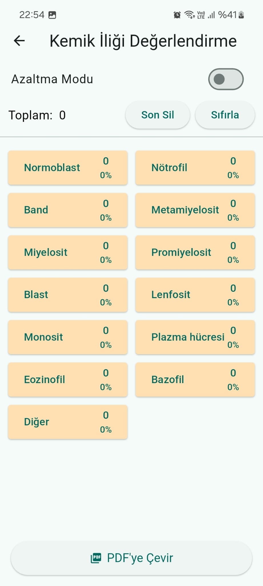

#  Pediatrik Hesaplamalar Mobil Uygulaması

**Pediatrik Hesaplamalar**, çocuk sağlığı alanında çalışan hekimler, hemşireler ve sağlık profesyonelleri için geliştirilmiş, yaygın kullanılan tıbbi hesaplamaları ve skorlamaları tek bir mobil uygulamada sunan yardımcı bir araçtır.

Bu uygulama, pediatri pratiğinde sıkça karşılaşılan klinik karar süreçlerini desteklemek amacıyla geliştirilmiştir.

---

##  Genel Bilgilendirme

- Uygulama yalnızca **sağlık profesyonelleri** tarafından kullanılmak üzere tasarlanmıştır.
- Hesaplamalar, ilgili tıbbi kaynaklara ve kılavuzlara uygun şekilde hazırlanmıştır.
- **Herhangi bir klinik karar**, sadece bu uygulamaya dayalı olarak verilmemeli; hekim değerlendirmesi ile birlikte ele alınmalıdır.

---

##  İşlevleri

### Hesaplama ve Skorlama Araçları

Aşağıdaki tıbbi hesaplama ve değerlendirme araçları uygulama içerisinde yer almaktadır:

- Anyon Gap Hesaplama  
- Apgar Skoru  
- Glaskow Koma Skalası (GKS)  
- Vücut Yüzey Alanı ve Günlük Sıvı İhtiyacı  
- Glikoz İnfüzyon Hızı (GIR)  
- QTc (Düzeltilmiş QT)  
- Düzeltilmiş Kalsiyum Hesabı  
- Periferik Yayma Değerlendirmesi  
- Düzeltilmiş Sodyum Hesabı  
- Düzeltilmiş Retikülosit Hesabı  
- Vücut Kitle Endeksi (BMI) Hesabı  
- Yenidoğan Vücut Yüzey Alanı Hesabı  
- Kemik İliği Değerlendirmesi

## Veri Güvenliği ve Sorumluluk

- Uygulama hiçbir kişisel veri ya da sağlık verisini kayıt altına almaz.
- Tüm hesaplamalar cihaz üzerinde çalışır; internet bağlantısı yalnızca güncelleme kontrolü ve geri bildirim gönderimi için kullanılır.
- Uygulama, **tanı koyma** veya **tedavi planlama** amacıyla kullanılmamalıdır. Yalnızca klinik karar süreçlerini destekleyici niteliktedir.

##  Ekran Görüntüleri
<table>
  <tr>
    <td></td>
    <td></td>
    <td></td>
  </tr>
  <tr>
    <td></td>
    <td></td>
  </tr>
</table>
