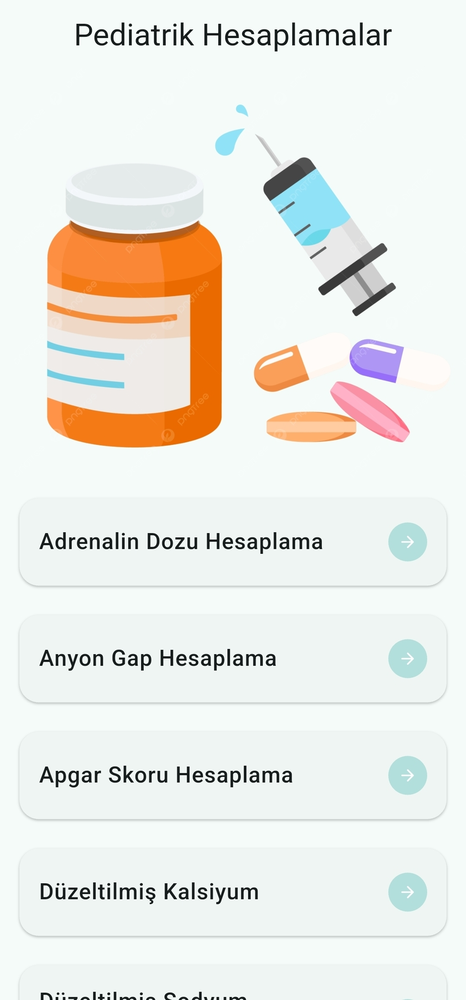
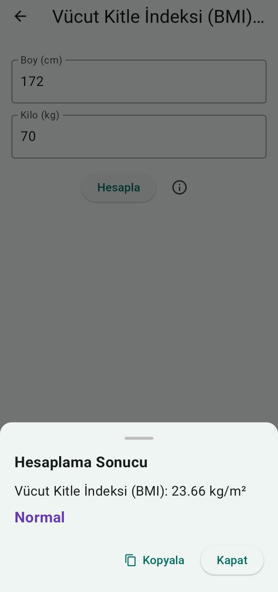
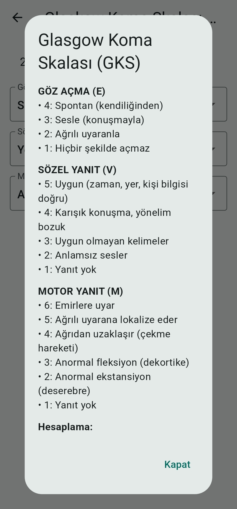

# Medikal Hesaplayıcı Uygulaması

Flutter ile geliştirilmiş bu mobil uygulama, sağlık profesyonelleri için çeşitli medikal hesaplamaları hızlı ve güvenilir bir şekilde yapma imkânı sunar.

Uygulama içerisinde yer alan bazı hesaplamalar:

- **Adrenalin Dozu**  
  Seçilen konsantrasyona göre mg ve ml dozları otomatik hesaplar.

- **Anyon Gap**  
  Sodyum, klor ve bikarbonat değerlerine göre anyon gap belirler.

- **Düzeltilmiş Kalsiyum**  
  Kalsiyum ve albümin düzeylerine göre düzeltilmiş kalsiyumu hesaplar.

- **Glaskow Koma Skoru**  
  Göz, sözlü ve motor yanıtlar seçilerek skor hesaplaması yapılır.
  2 yaş altı çocuklar için **Glaskow** ölçeği özelleştirilmiştir.
- **Fraksiyonel Sodyum Atılımı**  
  Prerenal ve renal yetmezlik ayrımında yardımcı olur.

- **GFR (Kreatinin Klerensi)**  
  Kilo, idrar hacmi, kreatinin ve üre değerleri ile glomerüler filtrasyon oranı hesaplanır.

## Ekran Görüntüleri

<table>
  <tr>
    <td align="center">
       
      <b></b>
    </td>
    <td align="center">
       
      <b>Düzeltilmiş Kalsiyum</b>
    </td>
  </tr>
  <tr>
    <td align="center">
       
      <b></b>
    </td>
    <td align="center">
       
      <b></b>
    </td>
  </tr>
</table>

